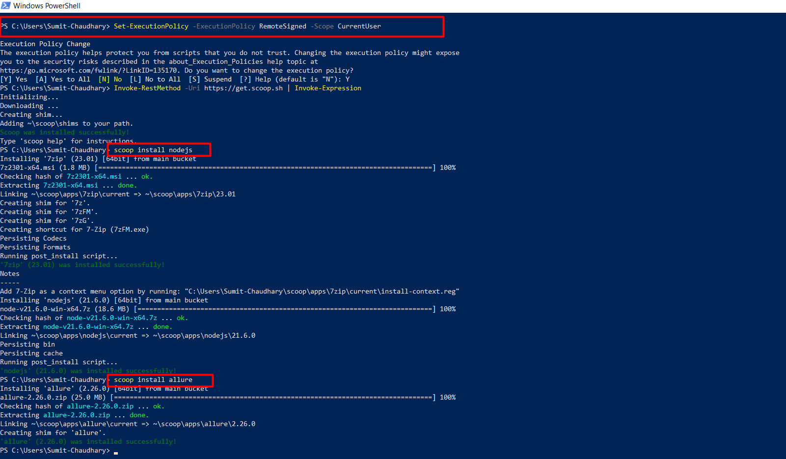
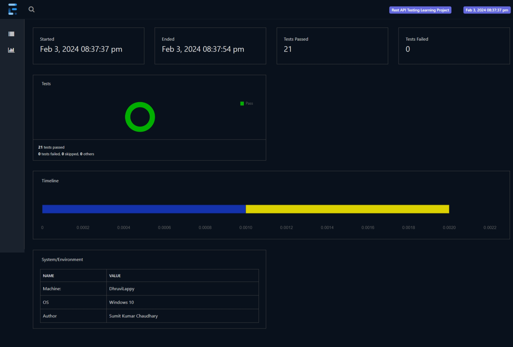

<table>
  <tr>
    <td></td>
    <td></td>
  </tr>
 </table>

# API Testing Framework with RestAssured, TestNG, Maven, and Allure Report

Welcome to an API testing framework that leverages RestAssured,
TestNG, Maven, and Allure Report to automate API testing.
This framework allows you to easily understand, run, and report on your API tests,
ensuring the reliability and functionality of your web services.

## Table of Contents
- [Project](#project)
- [Prerequisites](#prerequisites)
- [Adding Dependencies](#adding-dependencies)
- [Writing API Tests](#writing-api-tests)
- [Generating Allure Report Reports](#generating-Allure Report-reports)
- [Test Cases](#test-cases)
- [Running Tests](#running-tests)
- [Viewing Allure Report Reports](#viewing-Allure Report-reports)
- [My Introduction](#My Introduction)


# Project 

Rest API Automation Project brings you to understand the feature of Rest-assured library.
With the help of Rest-assured library, I try to demonstrate that how we can perform **CRUD** operation.
I have added different types of test cases that help to validate possible functionality of Rest API.
If you could suggest more than it would be more helpful.  


# Prerequisites to run the project seamlessly 

### Installation and Setup 


#### 1. Install java and set up the path:

<table>
   <tr>
      <td></td>
      <td> 
         <ol>
            <li>Download Java from <a href="https://www.oracle.com/java/technologies/downloads/">download link</a></li>
            <li>Setup java path in the <b>System variable</b></li>
            <li>Setup java path till the bin in the <b>System variable> Path</b></li>
            <li>    Open the command/ terminal and run the below command to check 
                     java is installed or not.
            </li>

```bash
    java --version 
   ```
and 

```bash
    javac --version 
   ```

   </ol>  
      </td>
   </tr>
</table>

----------------------------------------------------

#### 2. Download the maven

<table>
   <tr>
      <td></td>
      <td> 
         <ol>
            <li>Download maven from <a href="  https://maven.apache.org/download.cgi">download link</a></li>
            <li>Setup maven path in the <b>System variable</b></li>
            <li>Setup maven path till the bin in the <b>System variable> Path</b></li>
            <li>    Open the command/ terminal and run the below command to check 
                     maven is installed or not.
            </li>

```bash
    mvn --version 
   ```
   </ol>  
      </td>
   </tr>
</table>


  
1. Download and install any IDE (Eclipse or IntelliJ) 
    Eclipse: https://www.eclipse.org/downloads/packages/

    IntelliJ https://www.jetbrains.com/idea/download

2. Download the git and set up the path

   
    
    https://www.git-scm.com/downloads

3. Clone the Project in your system 

      ```bash
    git clone https://gitlab.com/sumitkchaudhary/RestAPIFramework.git 
    ```
4. Open the pom.xml file 
5. Right click on it and select Run> Maven installs 


## Open the project in your preferred IDE for further development.

## Adding Dependencies
In your pom.xml file, you should add the necessary dependencies for RestAssured, TestNG, and Allure Report.
Run mvn clean install to download these dependencies.

## Writing API Tests
You can write your API tests in Java using RestAssured.
We've provided a sample test case in the Writing API Tests section of the blog post.

## Generating Allure Report Reports
To create HTML reports for tests, we are using the Allure Report library.
To generate the report, you have to set up allure command line in your system

## Follow the below instruction to set up allure command line in a Window system

First Install scoop
https://scoop.sh/


Below command helps to install scoop
````
    Set-ExecutionPolicy -ExecutionPolicy RemoteSigned -Scope CurrentUser
````
After that run second command to get scoop

````
    scoop install nodejs 
````

After that run below command to install allure command line

````dtd
    scoop install allure
````

for more information, you can visit



https://allurereport.org/docs/gettingstarted-installation/


## Test cases

<table>
<tr>
<th>Test Cases</th>
<th>Classes</th>
</tr>
<tr>
<th>

1. Create new user record using POST Request:  </th>
<td>

[TestPOSTRequest.java](src%2Ftest%2Fjava%2Fcom%2FAPI_Testing%2FTestCasesScripts%2FTestPOSTRequest.java)</td>
</tr>
<tr>
<th>

2. Get user list using GET Request </th>
<td>

[TestGETRequest.java](src%2Ftest%2Fjava%2Fcom%2FAPI_Testing%2FTestCasesScripts%2FTestGETRequest.java)</td>
</tr>
<tr>
<th>

3. Get specific user detail by id using GET Request </th>
<td>

[TestGETRequestSingleUserData.java](src%2Ftest%2Fjava%2Fcom%2FAPI_Testing%2FTestCasesScripts%2FTestGETRequestSingleUserData.java)</td>
</tr>
<tr>
<th>

4. Update specific user detail using PUT Request</th>
<td>

[TestPUTRequest.java](src%2Ftest%2Fjava%2Fcom%2FAPI_Testing%2FTestCasesScripts%2FTestPUTRequest.java)</td>
</tr>
<tr>
<th>

5. Update specific user detail using PATCH request</th>
<td>

[TestPATCHRequest.java](src%2Ftest%2Fjava%2Fcom%2FAPI_Testing%2FTestCasesScripts%2FTestPATCHRequest.java)</td>
</tr>
<tr>
<th>

6. Delete the user by id using DELETE request</th>
<td>

[TestDeleteRequest.java](src%2Ftest%2Fjava%2Fcom%2FAPI_Testing%2FTestCasesScripts%2FTestDeleteRequest.java)</td>
</tr>
<tr>
<th>

7. API Authentication types</th>

</tr>
<tr>
<th>   

- Basic Authentication </th>
<td>

[BasicAuthenticationTest.java](src%2Ftest%2Fjava%2Fcom%2FAPI_Testing%2FTestCasesScripts%2FAuthentication%2FBasicAuthenticationTest.java)</td>
</tr>
<tr>
<th>   

- Digest Authentication </th>
<td>

[DigestAuthentication.java](src%2Ftest%2Fjava%2Fcom%2FAPI_Testing%2FTestCasesScripts%2FAuthentication%2FDigestAuthentication.java)</td>
</tr>
<tr>
<th>   

- O Auth 2 Authentication </th>
<td>

[OAuth2Authentication.java](src%2Ftest%2Fjava%2Fcom%2FAPI_Testing%2FTestCasesScripts%2FAuthentication%2FOAuth2Authentication.java)</td>
</tr>
<tr>
<th> 

- 0 Auth Authentication</th>
<td> 

[OAuthAuthentication.java](src%2Ftest%2Fjava%2Fcom%2FAPI_Testing%2FTestCasesScripts%2FAuthentication%2FOAuthAuthentication.java)</td>
</tr>
<tr>
<th>   - Preemptive Authentication</th>
<td>        

[PreemptiveAuthentication.java](src%2Ftest%2Fjava%2Fcom%2FAPI_Testing%2FTestCasesScripts%2FAuthentication%2FPreemptiveAuthentication.java)</td>
</tr>
<tr>
<th>

8. Add value in the existing json file </th>
<td> 

[TestAddValueInExistingData.java](src%2Ftest%2Fjava%2Fcom%2FAPI_Testing%2FTestCasesScripts%2FTestAddValueInExistingData.java)</td>
</tr>
<tr>
<th>

9. Append data in the json </th>
<td>

[TestAppendData_InJson.java](src%2Ftest%2Fjava%2Fcom%2FAPI_Testing%2FTestCasesScripts%2FTestAppendData_InJson.java)</td>
</tr>
<tr>
<th>

10. Compare two different json file</th>
<td> 

[TestCompareTwoJsonFile.java](src%2Ftest%2Fjava%2Fcom%2FAPI_Testing%2FTestCasesScripts%2FTestCompareTwoJsonFile.java)</td>
</tr>
<tr>
<th>

11. Extract single value from the json data. a)</th>
<td>

[TestExtractSingleKeyValueFromJSON.java](src%2Ftest%2Fjava%2Fcom%2FAPI_Testing%2FTestCasesScripts%2FTestExtractSingleKeyValueFromJSON.java)</td>
</tr>
<tr>
<th>

12. Extract multiple value from the json data. )</th>
<td>

[TestExtractMultiplekeyValueFromJson.java](src%2Ftest%2Fjava%2Fcom%2FAPI_Testing%2FTestCasesScripts%2FTestExtractMultiplekeyValueFromJson.java)</td>

</tr>
<tr>
<th>

13. Fetch value from json file. </th>
<td>

[TestFetchValueFromJsonFile.java](src%2Ftest%2Fjava%2Fcom%2FAPI_Testing%2FTestCasesScripts%2FTestFetchValueFromJsonFile.java)</td>
</tr>
<tr>
<th>

14. Fetch value in key form </th>
<td>

[TestGetValueByKeyFromJson.java](src%2Ftest%2Fjava%2Fcom%2FAPI_Testing%2FTestCasesScripts%2FTestGetValueByKeyFromJson.java)</td>
</tr>
<tr>
<th>

15. Add array data in the json data. </th>
<td>

[TestInsertNewArrayDataInExistingJSONData.java](src%2Ftest%2Fjava%2Fcom%2FAPI_Testing%2FTestCasesScripts%2FTestInsertNewArrayDataInExistingJSONData.java)</td>
</tr>
<tr>
<th>

16. Replace existing value in json. </th>
<td>

[TestInsertNewkeyInExistingJSONFile.java](src%2Ftest%2Fjava%2Fcom%2FAPI_Testing%2FTestCasesScripts%2FTestInsertNewkeyInExistingJSONFile.java)</td>
</tr>
<tr>
<th>

17. Add object data in the json data. </th>
<td>

[TestInsertNewObjectINExistingJSONdata.java](src%2Ftest%2Fjava%2Fcom%2FAPI_Testing%2FTestCasesScripts%2FTestInsertNewObjectINExistingJSONdata.java)</td>
</tr>
<tr>
<th>

18. Decrypt the json data. </th>
<td>

[TestPayLoadDecryption.java](src%2Ftest%2Fjava%2Fcom%2FAPI_Testing%2FTestCasesScripts%2FTestPayLoadDecryption.java)</td>
</tr>
<tr>
<th>

19. Encrypt the json data.</th>
<td> 

[TestPayloadEncrypt.java](src%2Ftest%2Fjava%2Fcom%2FAPI_Testing%2FTestCasesScripts%2FTestPayloadEncrypt.java)</td>
</tr>
<tr>
<th>

20. Update key and value on json data.</th>
<td> 

[TestUpdateKeyValueexistingJsonData.java](src%2Ftest%2Fjava%2Fcom%2FAPI_Testing%2FTestCasesScripts%2FTestUpdateKeyValueexistingJsonData.java)</td>
</tr>
<tr>
<th>

21. File upload functionality. </th>
<td>

[TestUploadFileFunctionality.java](src%2Ftest%2Fjava%2Fcom%2FAPI_Testing%2FTestCasesScripts%2FTestUploadFileFunctionality.java)</td>
</tr>
</table>

## Running Tests

You can run your API tests using Maven:
```bash
mvn clean test
```

## Viewing Allure Reports
As soon
as we run the TestNg.xml file
where our test cases as integrated, then we get an allure result in json format in the target folder

To convert an allure json result into an HTML format run below command


```text
    allure serve F:\Sumit_Project_Works\RestAPIFramework\target\allure-results 
```
***NOTE: Above command has directory path, so change it according to your system***

Or you can run another command

```text
    mvn allure:serve
```
***NOTE: Above command is more advance but run from the directory allure json result has saved***



-------------------------------

# My Introduction
 

<table>
  <br>
    <td> </td>
   <td> Dear Friend, <br><b> First, thank you to visit this page.</b> <br>I am Sumit Kumar - I have been involved in several automation projects which includes Web, API, and Android as Software QA Engineer.
</td>
  </tr>
 </table>
